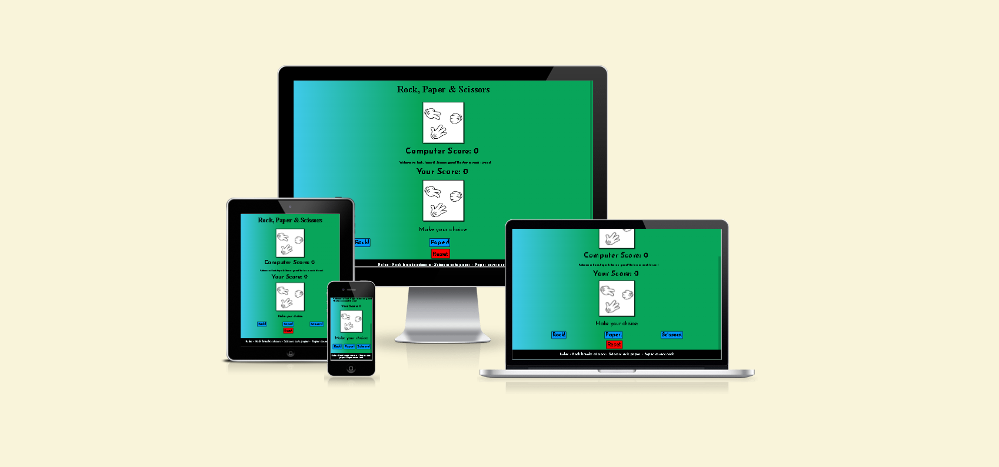

# Rock, Paper & Scissors

I've developed a rock-paper-scissors game where users compete against the computer to be the first to reach 10 points. The game features a simple layout and vibrant color scheme to enhance the user experience.

Visit the deployed website [here](https://seanpatton1.github.io/rock-paper-scissors/).

## Table of Contents

1. [User Experience (UX)](#user-experience-ux)
    1. [Project Goals](#project-goals)
    2. [User Stories](#user-stories)
    3. [Color Scheme](#color-scheme)
    4. [Typography](#typography)
    5. [Basic Design](#basic-design)
2. [Features](#features)
    1. [General](#general)
    2. [Landing Page](#landing-page)
    3. [Game page](#game-page)
 3. [Technologies Used](#technologies-used)
    1. [Languages Used](#languages-used)
    2. [Libraries and Programs Used](#libraries-and-programs-used)
4. [Testing](#testing)
    1. [Testing User Stories](#testing-user-stories)
    2. [Code Validation](#code-validation)
    3. [Accessibility](#accessibility)
    4. [Tools Testing](#tools-testing)
    5. [Manual Testing](#manual-testing)
5. [Finished Product](#finished-product)
6. [Deployment](#deployment)
    1. [GitHub Pages](#github-pages)
7. [Credits](#credits)
    1. [Content](#content)
    2. [Media](#media)
    3. [Code](#code)
8. [Acknowledgements](#acknowledgements)

***

## User Experience (UX)

### Project Goals

* The game page presents an inviting layout with supporting images for enhanced gameplay.

* Provide the user with a visual indication of the current score and clear game rules.

* Enable the user to view the outcome through an on-screen message once a selection is made.

### User Stories

* As a customer, I desire a clear indication of how to play the game.

* As a customer, I want to be aware of both my score and the computer's score.

* As a customer, I desire an attractive color scheme and layout.

* As a customer, I want an end game result or target score to aim for.

### Color Scheme

### Typography

I have selected Josefin Sans for the entirety of the website. On the game page, the font styling varies, with bolder fonts used for the score area. The same bold styling is applied to the game buttons and the game rules in the footer.

### Basic Design

I've outlined the design on pen and paper, creating multiple versions before finalizing the current live project. The design was focused on ensuring everything is within view of the user, including specific adjustments for the mobile view to accommodate the placement of the user's hand while holding the phone.

## Features

### General

* The colour scheme chosen consists on is green and blue with black and white fonts. I have used a linear gradient for the background combining the green and blue. 

* The website has been optimized to function seamlessly across multiple screen sizes, from mobile and tablet to desktop computers, utilizing responsive design. It adjusts the page layout according to the user's device to cater to as many users as possible.

* **Header**

!

- Font size adjusts as the screen sizes grows

- As this is a standalone page there are no nav links in the header

* **Footer**

!

- The footer give the user the rules of the game.

### Game page

!

- I have utilized images from [Pinterest](https://in.pinterest.com/pin/747879081845727421/) to user for the game images. I have then split these up to display as the user selects their choice.

## Technologies Used

### Languages Used

* HTML5(https://en.wikipedia.org/wiki/HTML5)
* CSS(https://en.wikipedia.org/wiki/CSS)
* JavaScript(https://en.wikipedia.org/wiki/JavaScript)

### Libraries and Programs Used

* [Google Fonts](https://fonts.google.com/)
    - Google Fonts was used to import the font Oswald with sans-serif as a backup.

* [GitPod](https://gitpod.io/)
    - GitPod was used for writing code, committing, and then pushing to GitHub.

* [GitHub](https://github.com/)
    - GitHub was used to store the project after pushing.

* [Pen and Pad design]
    - I designed the website not on Balsamiq but on pen and paper.

* [Am I Responsive?](http://ami.responsivedesign.is/#)
    - Am I Responsive was used to check responsivness of the website on each page over multiple devices.

* [Chrome DevTools](https://developer.chrome.com/docs/devtools/)
    - Chrome DevTools was used during development process for code review and fix any visual errors throught the creation of the website.

* [W3C Markup Validator](https://validator.w3.org/)
    - W3C Markup Validator was used to validate the HTML code.

* [W3C CSS Validator](https://jigsaw.w3.org/css-validator/)
    - W3C CSS Validator was used to validate the CSS code.

* [JSHint](https://jshint.com/)
    - JSHint was used to validate the JavaScript code.

[Back to top ⇧](#rock-paper-scissors)

## Testing

### Testing User Stories

* As a customer, I want to know the rules of the game before playing

     - The rules for the game are set in the footer of the page

* As a customer, I want to be able to compete again the computer

    - There is JavaScript set to allow the user to play against the computer

* As a customer, I want and interesting design to help me engage with the game

    - I have selected a colour scheme and design to help engagement

* As a customer, I want to be able to track my correct answers

    - THe game shows the user how many correct answers both they have made and the computer

* As a customer, I want to have a clear goal to win the game

    - The game is designed as first to 10 with a display message telling the user who won

### Code Validation

* The [W3C Markup Validator](https://validator.w3.org/), [W3C CSS Validator](https://jigsaw.w3.org/css-validator/) and [JSHint](https://jshint.com/)

### Accessibility

* Used Lighthouse 

* Lighthouse reports
        
        - **Game Page**

        - Mobile View
        !insert image

        - Desktop View
        !insert image

    

### Tools Testing

* [Chrome DevTools](https://developer.chrome.com/docs/devtools/)

    - Chrome dev tools was used throughout the development of the project, testing mostly CSS design with some minor changes in HTML to test structure.

* Responsiveness
    
    - [Am I Responsive?](http://ami.responsivedesign.is/#) 

    - [Responsive Design Checker](https://www.responsivedesignchecker.com/) 
    
    - [Chrome DevTool](https://developer.chrome.com/docs/devtools)

### Manual Testing

* Device compatibility

    - The website has been tested on multiple devices, including:

* Elements Testing

    - All Pages
        
        - **Header**
            - Header correct accross different devices 

[Back to top ⇧](#guitar-history-101)

### Validator errors

## Finished Product

### Landing Page

[Back to top ⇧](#guitar-history-101)

## Deployment

* This website was developed using [GitPod](https://www.gitpod.io/), which was then committed and pushed to GitHub using the GitPod terminal.

## Credits 

* Images on website used from (https://pixabay.com/images/search/acoustic%20/)

### Content

- Almost all content written by developer

### Media

* [Pixabay](https://pixabay.com/)

*  [Font Awesome](https://fontawesome.com/search)
   

### Code

- 

- 

- 

- [YouTube](https://www.youtube.com/), [Stack Overflow](https://stackoverflow.com/) and [W3schools](https://www.w3schools.com/) were used throughout the creation of this project.

[Back to top ⇧](#guitar-history-101)

## Acknowledgements

- 

- 

- 
- 

[Back to top ⇧](#guitar-history-101)
